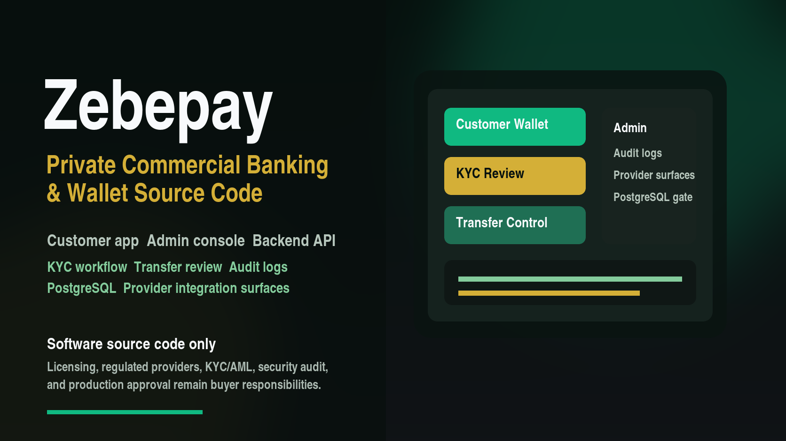

# Zebepay

Investor-grade Nigerian banking and wallet infrastructure foundation.

Zebepay is a commercial source-code product for fintech founders, agencies, developers, cooperatives, and licensed operators who need a serious Nigerian banking/wallet platform foundation.

This product is software only. Buyers are responsible for licensing, regulatory approval, banking/payment partners, production security audits, KYC/AML provider setup, and live payment rail authorization.

## Available For Private Sale

Zebepay is a developed Nigerian wallet and banking infrastructure source-code
foundation available for private commercial sale. Pricing is flexible and can be
set to any MD-approved amount based on the buyer package, source access, setup
support, deployment support, or white-label customization required.

Zebepay should be delivered as a private commercial source-code product. A
public wrapper may show the product summary, screenshots, buyer FAQ, and contact
instructions, but the full source-code repository, buyer ZIP, release tags, and
buyer access must remain gated by MD approval.

Buyer-facing materials:

- [Commercial Buyer Pack](./docs/commercial/README.md)
- [Buyer Sales Page](./docs/commercial/BUYER_SALES_PAGE.md)
- [Pricing And Offer](./docs/commercial/PRICING_AND_OFFER.md)
- [Buyer Demo Checklist](./docs/commercial/BUYER_DEMO_CHECKLIST.md)
- [Public And Private Packaging Plan](./docs/PUBLIC_PRIVATE_PACKAGING_PLAN.md)
- [Buyer Production Warning](./BUYER_PRODUCTION_WARNING.md)
- [Buyer Evaluation Agreement](./BUYER_EVALUATION_AGREEMENT.md)

## Product Scope

Zebepay is designed as a serious source-code foundation with buyer-visible
apps, API, data model, operations workflows, and production integration
boundaries:

- Customer banking app with API-backed auth, accounts, transfers, beneficiaries, statements, notifications, OTP, and device trust flows
- Admin operations dashboard with API-backed auth, customers, KYC review, transfer review, release/reject, audit, and reconciliation flows
- Backend API
- PostgreSQL database
- Ledger posting model with reversal support
- Wallet/account system
- Nigerian bank directory and bank-code support
- NGN/kobo money handling
- KYC workflow with BVN/NIN-ready fields
- Tiered limits
- Trusted device, OTP, and transfer-risk review controls
- Transfer workflow with sandbox funding-intent and payout-dispatch provider handoff surfaces
- Notification outbox for banking events
- Provider integration extension points documented for licensed buyer implementation
- Transfer status and ledger records, with receipt generation marked as a roadmap item
- Reconciliation summary workflow with live provider settlement reconciliation marked as buyer hardening work
- Audit logs
- Sales, setup, and release documentation

## Apps And Services

```text
apps/
  customer-web/        Customer-facing banking app
  admin-web/           Back-office operations dashboard
services/
  api/                 Backend API and banking domain services
packages/
  shared/              Shared types, constants, validation schemas
docs/
  Product, architecture, compliance, and buyer documentation
sales/
  Sales-page copy, pricing rationale, buyer FAQ
release/
  Commercial release checklist and audit notes
.github/
  GitHub issue templates, pull request checklist, and CI workflow
```

## Product Image



## Nigerian Banking Orientation

Zebepay is structured around Nigerian fintech requirements:

- Naira-native balances stored in kobo
- Nigerian bank codes and account lookup adapter design
- NUBAN-style account-number generation support
- BVN/NIN-ready onboarding flow
- KYC tiering
- NIP/NIBSS-style transaction status model
- Documented integration points for Paystack, Monnify, Flutterwave, bank sponsors, and sandbox rails

## Commercial Boundary

Zebepay does not provide:

- A banking license
- Direct NIBSS access
- Regulated payment processing rights
- Production KYC/AML approval
- Legal or compliance certification

The buyer must connect licensed providers and complete legal, compliance, security, and regulatory review before live use.

## Buyer Verification Commands

Approved buyers or evaluators should verify the package with:

```bash
npm install --include=dev
npm run build
npm run lint
npm test
npm run smoke:postgres
```

## Development Status

Fullstack package candidate is implemented for controlled buyer review. Public launch remains gated by final MD approval of commercial terms, buyer access, repository visibility, support scope, and regulated-production caveats.

See:

- [Product Blueprint](./docs/PRODUCT_BLUEPRINT.md)
- [Architecture](./docs/ARCHITECTURE.md)
- [Nigeria Banking Model](./docs/NIGERIA_BANKING_MODEL.md)
- [Phase 5 Security Risk Notifications](./docs/PHASE-005-SECURITY-RISK-NOTIFICATIONS.md)
- [Phase 6 Buyer Package](./docs/PHASE-006-BUYER-PACKAGE.md)
- [Phase 7 GitHub Delivery](./docs/PHASE-007-GITHUB-DELIVERY.md)
- [Phase 8 Marketplace Launch](./docs/PHASE-008-MARKETPLACE-LAUNCH.md)
- [Phase 9 Buyer Fulfillment](./docs/PHASE-009-BUYER-FULFILLMENT.md)
- [Phase 10 Commercial Decision Gate](./docs/PHASE-010-COMMERCIAL-DECISION-GATE.md)
- [Phase 11 Product Image Asset](./docs/PHASE-011-PRODUCT-IMAGE-ASSET.md)
- [Phase 12 Buyer Deal Room](./docs/PHASE-012-BUYER-DEAL-ROOM.md)
- [Phase 13 Commercial Product Integrity Audit](./docs/PHASE-013-COMMERCIAL-PRODUCT-INTEGRITY-AUDIT.md)
- [Phase 21 PostgreSQL Production Readiness Gate](./docs/PHASE-021-POSTGRES-PRODUCTION-READINESS-GATE.md)
- [Phase 22 Release Hardening Buyer Handoff](./docs/PHASE-022-RELEASE-HARDENING-BUYER-HANDOFF.md)
- [Phase 23 GitHub Commercial Packaging](./docs/PHASE-023-GITHUB-COMMERCIAL-PACKAGING.md)
- [Phase 24 Zebepay Brand Alignment](./docs/PHASE-024-ZEBEPAY-BRAND-ALIGNMENT.md)
- [Phase 25 Private GitHub Delivery](./docs/PHASE-025-PRIVATE-GITHUB-DELIVERY.md)
- [Brand Governance](./docs/BRAND_GOVERNANCE.md)
- [Paystack Differentiation](./docs/PAYSTACK_DIFFERENTIATION.md)
- [Setup Guide](./docs/SETUP_GUIDE.md)
- [Deployment Guide](./docs/DEPLOYMENT_GUIDE.md)
- [API Reference](./docs/API_REFERENCE.md)
- [Troubleshooting](./docs/TROUBLESHOOTING.md)
- [Buyer Handoff](./docs/BUYER_HANDOFF.md)
- [License Terms Draft](./docs/LICENSE_TERMS_DRAFT.md)
- [Release Notes](./docs/RELEASE_NOTES.md)
- [Buyer Support](./SUPPORT.md)
- [GitHub Delivery](./docs/GITHUB_DELIVERY.md)
- [GitHub Buyer Access Model](./docs/GITHUB_BUYER_ACCESS_MODEL.md)
- [GitHub Release Body](./release/GITHUB_RELEASE_BODY.md)
- [GitHub Repository Checklist](./release/GITHUB_REPOSITORY_CHECKLIST.md)
- [Final Release Audit](./release/FINAL_RELEASE_AUDIT.md)
- [Package Manifest](./release/PACKAGE_MANIFEST.md)
- [Marketplace Launch Checklist](./release/MARKETPLACE_LAUNCH_CHECKLIST.md)
- [Buyer Fulfillment Checklist](./release/BUYER_FULFILLMENT_CHECKLIST.md)
- [Commercial Decision Record](./release/COMMERCIAL_DECISION_RECORD.md)
- [Buyer Access SOP](./release/BUYER_ACCESS_SOP.md)
- [Security Policy](./SECURITY.md)
- [Changelog](./CHANGELOG.md)
- [Release Checklist](./release/RELEASE_CHECKLIST.md)
- [Sales Page Copy](./sales/SALES_PAGE_COPY.md)
- [Private Sales Listing](./sales/PRIVATE_SALES_LISTING.md)
- [Controlled Sales Conversion Pack](./sales/CONTROLLED_SALES_CONVERSION_PACK.md)
- [Buyer FAQ](./sales/BUYER_FAQ.md)
- [Launch Assets](./sales/LAUNCH_ASSETS.md)
- [Deal Room](./sales/DEAL_ROOM.md)
- [Post-Purchase Emails](./sales/POST_PURCHASE_EMAILS.md)
- [Support Policy Draft](./sales/SUPPORT_POLICY_DRAFT.md)
- [Pricing Packages](./sales/PRICING_PACKAGES.md)
- [Commercial Terms Draft](./sales/COMMERCIAL_TERMS_DRAFT.md)
